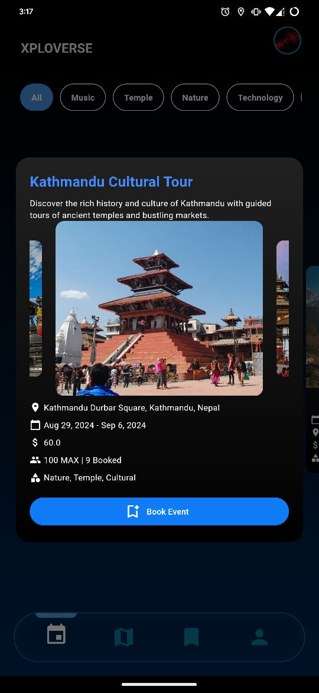

## Xploverse - Explore the Universe of Events

Xploverse is a mobile application designed to help users explore, discover, and participate in events. It offers a seamless experience for both event organizers and attendees, with a focus on intuitive navigation, robust features, and a minimalistic black and blue theme.

## Table of Contents
- [Overview](#overview)
- [Features](#features)
- [Screenshots](#screenshots)
- [Installation](#installation)
- [Usage](#usage)
- [Contributing](#contributing)

## Overview
Xploverse enables users to view events on a map, get detailed information, book tickets, and even navigate to event locations. The app leverages Google Maps for geolocation and Firebase for backend data storage. Event organizers can create and manage events directly through the app, and all users benefit from a secure authentication process.

## Features
- **Event Map View**: Visualize all available events on an interactive map.
- **Event Creation and Management**: Organizers can easily create, manage, and schedule events.
- **Ticket Booking**: Users can book tickets within the app, which generates a QR code for event entry.
- **User Authentication**: Secure login for users, and organizers.
- **Navigation to Event**: Users can view the route to events directly from the app.
- **Customizable Markers**: Event locations on the map are marked with the Xploverse logo.

## Screenshots
Here are some screenshots of the Xploverse app:

- **Home Screen**: Overview of all events with map integration.  
  

- **Event Details**: Detailed information about a selected event, including location, date, and time.  
  

- **Ticket Booking**: Ticket booking and ticket generation process.  
  

- **QR Code for Entry**: Each booked ticket generates a unique QR code for verification at the event.  
  
  

- **User Profile**: Manage your account and view your event history.  
  


## Installation
To run the Xploverse app locally:

## Clone the repository:
```bash
git clone https://github.com/RohitSth/xploverse_flutter.git
```

## Navigate to the project directory:
```bash
cd xploverse_flutter
```

## Install dependencies:
```bash
flutter pub get
```

## Run the app:
```bash
flutter run
```

## Usage
- **For Users**: Browse events, book tickets, and navigate to event locations.
- **For Organizers**: Create and manage your events, view analytics, and interact with attendees.

## Contributing
I welcome contributions from the community. If you have an idea for a new feature or want to fix a bug, feel free to open an issue or submit a pull request.